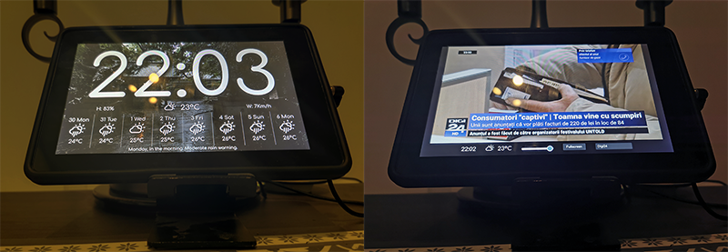

# Smart Clock - _digital signage_

Smart Clock is a light web application written in React that displays time, weather, videos (maybe other things in the future) on a tablet-like device or anything with a browser. 

Kindle 1 2011 (Upgraded to slimp ROM) running Smart Slock under Fully.


[Demo](https://sonictruth.github.io/smart-clock/). Swipe to go to the next screen.

Use [Fully Kiosk Browser](https://www.fully-kiosk.com/#get-kiosk-apps) or 
_Add to Home screen_ for a full screen experience.

### Start
```REACT_APP_OPEN_WEATHER_URL=https://api.openweathermap.org/data/2.5/onecall REACT_APP_OPEN_WEATHER_KEY=xxxxxxxx npm run start```

### Deploy
```REACT_APP_OPEN_WEATHER_URL=https://api.openweathermap.org/data/2.5/onecall REACT_APP_OPEN_WEATHER_KEY=xxxxxxxx npm run deploy```
